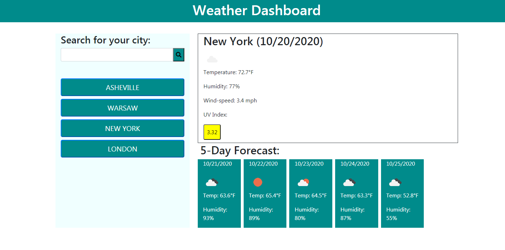

# Weather-Dashboard

## Description
  
An application to show the weather conditions in any city in the world.

When you open this application, you are able to enter a city anywhere in the world or choose from your previously searched cities. Whichever you choose, you should then be presented with the current weather in that city, as well as the 5 Day forecast. The city should also be added to your list of previously searched cities.

  
## Table of Contents

- [Installation](https://github.com/kas1330/Weather-Dashboard#installation)

- [Usage](https://github.com/kas1330/Weather-Dashboard#usage)

- [License](https://github.com/kas1330/Weather-Dashboard#license)

- [Contributions](https://github.com/kas1330/Weather-Dashboard#contributions)

- [Testing](https://github.com/kas1330/Weather-Dashboard#testing)

- [Questions](https://github.com/kas1330/Weather-Dashboard#questions)

- [Repo](https://github.com/kas1330/Weather-Dashboard#repo)

- [Deployed](https://github.com/kas1330/Weather-Dashboard#deployed)

## Installation

Use git clone to copy the repository to your computer. you should then be able to launch index.html in your browser. Or view the app where it's deployed in github pages.

## Usage

Use this app to search for the weather in any city in the world.

## License

 None

## Contributions

 Submit a pull request.

## Testing

To test the function of the application, after you either launch from GitHub pages or from your own browser, type a city into the search bar. The current weather conditions as well as the 5-day forecast should populate in the empty fields. When the page is refreshed it should show the results of the last city you searched. If no reults are displaying, it's possible the api key is no longer working, please contact me so this can be addressed.

## Questions

 https://github.com/kas1330

 k.sexton804@gmail.com

 ## Repo

https://github.com/kas1330/Weather-Dashboard
 
## Deployed

https://kas1330.github.io/Weather-Dashboard/

